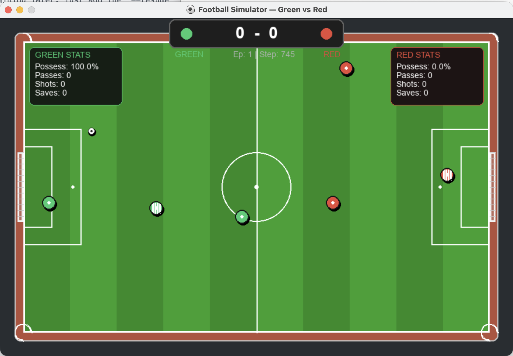
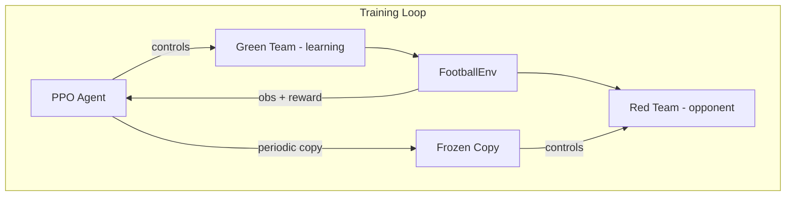
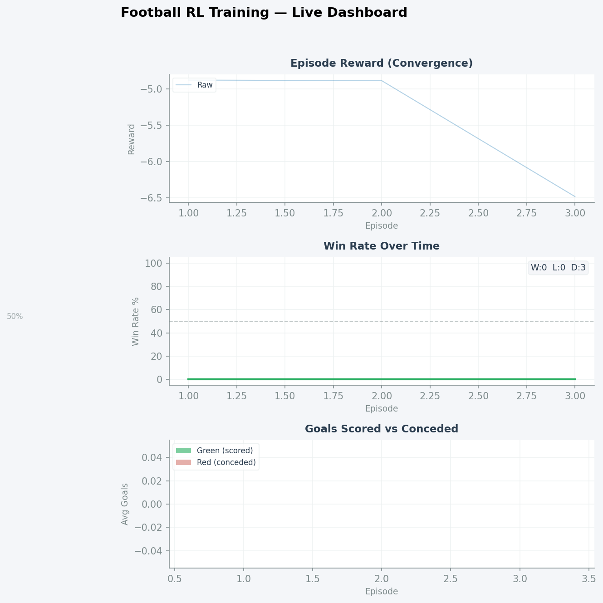

# ⚽ Football Simulator with Reinforcement Learning

A 3v3 football (soccer) simulator where AI agents learn to play football through **self-play reinforcement learning**. Two teams — **Green** and **Red** — each with 2 outfield players and 1 goalkeeper, compete on a scaled-down pitch. The agents learn to pass, shoot, defend, and save goals using PPO (Proximal Policy Optimization).


---

## 🚀 Quick Start

### 1. Install Dependencies

```bash
# Navigate to the project directory
cd "Reinforcement learning"

# Install all required packages
pip install -r requirements.txt
```

### 2. Run the Rule Tests (verify everything works)

```bash
python test_rules.py
```

Expected output:
```
✅ Environment creation: PASSED
✅ Kickoff position: PASSED
✅ Goal scoring: PASSED
...
Results: 11 passed, 0 failed out of 11 tests
```

### 3. Train the Agent

#### Quick Commands
```bash
# 🔥 OPTIMAL FOR MAC: Fast training with live plots and TensorBoard logging
python train.py --timesteps 20000000 --log --resume

# 🎮 VISUAL MODE: Occasionally watch a match every 500 episodes
python train.py --render --timesteps 20000000 --log --render_every 500
```

#### Training Options
| Flag | Default | Description |
|------|---------|-------------|
| `--timesteps` | 2,000,000 | Total training steps |
| `--resume` | off | Resume training from latest checkpoint |
| `--device` | `cpu` | Training device (`cpu`, `mps`, `cuda`, `auto`) |
| `--log` | off | Enable TensorBoard logging |
| `--render` | off | Enable live Pygame visualization |
| `--render_every` | 20 | Show match every N episodes |
| `--render_speed` | 1.5 | Playback speed for visual matches |
| `--lr` | 3e-4 | Learning rate |
| `--batch_size` | 256 | Batch size |
| `--selfplay_interval` | 50,000 | Steps between opponent updates |

#### Watching Progress with TensorBoard
```bash
# In an second terminal, run:
tensorboard --logdir logs
# Then open http://localhost:6006
```

### 4. Watch Trained Agent Play

```bash
# Watch 5 matches with the trained model
python play.py --model checkpoints/football_ppo_final --episodes 5

# Watch random agents play (no training needed)
python play.py
```

---



## 🏟️ Game Overview

| Feature | Details |
|---------|---------|
| **Teams** | Green (left) vs Red (right) |
| **Players** | 2 outfield + 1 goalkeeper per side |
| **Pitch** | 800×500 px scaled-down pitch |
| **Win condition** | First team to score **2 goals** |
| **Goalkeeper** | Team color jersey with **white stripes** |

### Controls & Actions (AI-controlled)
Each player can perform 2 actions per step:
- **Move**: 8 directions + stay still
- **Kick/Pass**: 8 directions + no kick

---

## 📋 Football Rules Implemented

| Rule | How it works |
|------|-------------|
| **Kickoff** | Ball at center, alternates after each goal |
| **Throw-in** | Ball crosses sideline → opposing team throws in |
| **Goal kick** | Ball crosses end-line (by attacker) → GK kicks |
| **Corner kick** | Ball crosses end-line (by defender) → attacker gets corner |
| **Free kick** | Awarded after a foul, from foul location |
| **Fouls** | Failed tackles may be called as fouls |
| **Offside** | Attacker behind last defender when receiving in opponent's half |
| **GK handling** | Goalkeeper can only hold ball in penalty box |
| **GK movement** | Goalkeeper restricted to own half |
| **Stamina** | Players tire when sprinting, recover when idle |
| **Tackles** | Success depends on distance & stamina |
| **Collisions** | Players physically push each other apart |
| **Ball physics** | Friction, speed caps, realistic movement |

---

## 🤖 RL Architecture



- **Algorithm**: PPO with `[256, 256, 128]` networks
- **Self-play (Opponent Pool)**: Saves the last 5 checkpoints and randomly samples an opponent every episode to prevent strategy cycling
- **Observation**: 18D mirrored vector (player positions, ball, scores)
- **Actions**: 6 discrete values (3 players × move + kick)

### Reward Signals
| Signal | Value |
|--------|-------|
| Score a goal | +5.0 |
| Concede a goal | -5.0 |
| Win match | +10.0 |
| Lose match | -10.0 |
| Ball toward goal | +0.02 × progress |
| Time penalty | -0.001/step |
| Spacing penalty | -0.01/step (if players clump < 60px) |
| Shot on target | +0.2 |
| Shot quality (xG) | +0.5 × xG |
| Successful Pass | +0.1 |
| Progressive pass | +0.1 (added to base pass) |
| Key pass | +0.2 (added to base pass) |
| Turnover recovery / Interception | +0.2 (+0.3 extra if high press) |
| Goalkeeper Save | +2.0 |
| Assist Bonus | +1.5 |

---

## 📁 Project Structure

```
Reinforcement learning/
├── football_env.py       # Core Gymnasium environment + rules
├── renderer.py           # Pygame rendering (pitch, players, ball)
├── self_play_wrapper.py  # Multi-agent → single-agent wrapper
├── train.py              # PPO training with self-play + live viz
├── play.py               # Watch matches with Pygame
├── test_rules.py         # Automated rule verification tests
├── requirements.txt      # Python dependencies
├── README.md             # This file
├── checkpoints/          # Saved model checkpoints (created during training)
└── logs/                 # TensorBoard logs (created with --log flag)
```

---

## 🎮 Viewer Options

```bash
python play.py [OPTIONS]
```

| Flag | Default | Description |
|------|---------|-------------|
| `--model` | None | Path to trained model (random if not set) |
| `--opponent_model` | None | Path to red team model |
| `--episodes` | 3 | Number of matches |
| `--speed` | 1.0 | Playback speed |
| `--deterministic` | off | Less random action selection |

---

## 📊 Recommended Training Schedule

| Phase | Timesteps | What to Expect |
|-------|-----------|----------------|
| **Early** | 0–5M | Random movement, occasional accidental goals |
| **Mid** | 5M–15M | Basic ball-chasing, some passing attempts |
| **Late** | 15M–25M+ | Coordinated play, passing, goal-saving |

> **Tip**: Run with `--render --render_every 50` to watch improvement over time without slowing training too much.

---

## 📈 Live Training Analytics
When you start training, a live Matplotlib dashboard will pop up, actively tracking **Canonical Win Rates**, **Goal Differentials**, and **Accumulated Rewards** over time.

Crucially, because the agent plays symmetrically, the dashboard tracks the **Overall Learning Agent Win Rate** against the separate Physical side win rates (**Green vs Red**), allowing you to seamlessly detect side-bias anomalies.



***

<div align="center">

*"Some people think football is a matter of life and death. I assure you, it's much more serious than that."* – Bill Shankly  
**Let the training begin, and may the best AI win! 🚀🏆**

</div>
