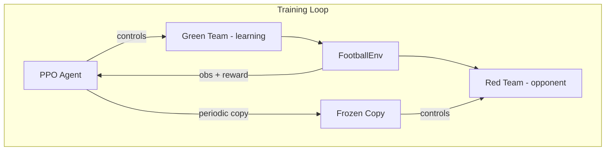

# ⚽ AI Football 3v3: Self-Play Reinforcement Learning

A high-performance 3v3 football (soccer) simulator where AI agents learn to master the game through **self-play reinforcement learning**. Featuring a custom physics engine, realistic football rules, and a deep learning pipeline, this project demonstrates how complex team coordination can emerge from simple reward signals.


---

## 🚀 Quick Start

### 1. Install Dependencies

```bash
# Navigate to the project directory
cd "Reinforcement learning"

# Install all required packages
pip install -r requirements.txt

# (Optional) Activate the virtual environment
# On macOS/Linux:
source .venv/bin/activate

# On Windows (PowerShell):
.\.venv\Scripts\Activate.ps1
```

### 2. Run the Rule Tests (verify everything works)

```bash
python test_rules.py
```

Expected output:
```
✅ Environment creation: PASSED
✅ Kickoff position: PASSED
✅ Goal scoring: PASSED
...
Results: 11 passed, 0 failed out of 11 tests
```

### 3. Train the Agent

#### Quick Commands
```bash
# 🔥 OPTIMAL FOR MAC: Fast training with live plots and TensorBoard logging
python train.py --timesteps 20000000 --log --resume

# 🎮 VISUAL MODE: Occasionally watch a match every 500 episodes
python train.py --render --timesteps 20000000 --log --render_every 500
```

#### Training Options
| Flag | Default | Description |
|------|---------|-------------|
| `--timesteps` | 2,000,000 | Total training steps |
| `--resume` | off | Resume training from latest checkpoint |
| `--device` | `cpu` | Training device (`cpu`, `mps`, `cuda`, `auto`) |
| `--log` | off | Enable TensorBoard logging |
| `--render` | off | Enable live Pygame visualization |
| `--render_every` | 20 | Show match every N episodes |
| `--render_speed` | 1.5 | Playback speed for visual matches |
| `--lr` | 3e-4 | Learning rate |
| `--batch_size` | 256 | Batch size |
| `--selfplay_interval` | 50,000 | Steps between opponent updates |

#### 📊 Recommended Training Schedule

| Phase | Timesteps | What to Expect |
|-------|-----------|----------------|
| **Early** | 0–5M | Random movement, occasional accidental goals |
| **Mid** | 5M–15M | Basic ball-chasing, some passing attempts |
| **Late** | 15M–25M+ | Coordinated play, passing, goal-saving |

> **Tip**: Run with `--render --render_every 50` to watch improvement over time without slowing training too much.

#### 📈 Live Training Analytics
When you start training, a live Matplotlib dashboard will pop up, actively tracking **Canonical Win Rates**, **Goal Differentials**, and **Accumulated Rewards** over time.

Crucially, because the agent plays symmetrically, the dashboard tracks the **Overall Learning Agent Win Rate** against the separate Physical side win rates (**Green vs Red**), allowing you to seamlessly detect side-bias anomalies.


#### Watching Progress with TensorBoard
```bash
# In an second terminal, run:
tensorboard --logdir logs
# Then open http://localhost:6006
```

### 4. Watch Trained Agent Play

```bash
# Watch 5 matches with the trained model
python play.py --model checkpoints/football_ppo_final --episodes 5

# Watch random agents play (no training needed)
python play.py
```

#### 🎮 Viewer Options

| Flag | Default | Description |
|------|---------|-------------|
| `--model` | None | Path to trained model (random if not set) |
| `--opponent_model` | None | Path to red team model |
| `--episodes` | 3 | Number of matches |
| `--speed` | 1.0 | Playback speed |
| `--deterministic` | off | Less random action selection |

---


---

## ⚽ The Simulation

### 🏟️ Field & Mechanics
| Feature | Details |
|---------|---------|
| **Teams** | Green (left) vs Red (right) |
| **Players** | 2 outfield + 1 goalkeeper per side |
| **Pitch** | 800×500 px scaled-down pitch |
| **Win condition** | First team to score **2 goals** |
| **Goalkeeper** | Team color jersey with **white stripes** (restricted to own half) |

### 📋 Football Rules Implemented
| Rule | Implementation |
|------|-------------|
| **Set Pieces** | Kickoffs, Throw-ins, Goal kicks, Corner kicks, and Free kicks |
| **Gameplay** | Offsides, Fouls (tackles), Stamina/Sprinting, and Ball physics with friction |
| **Goalkeeping** | Handling restricted to penalty box; automatic shot-saving logic |

---

## 🧠 Intelligence & Learning

### 🏗️ RL Architecture


- **Algorithm**: PPO (Proximal Policy Optimization) with `[256, 256, 128]` hidden layers.
- **Self-play**: Randomized sampling from a pool of the last 5 checkpoints to ensure robust strategy emergence.
- **Observations**: 18-dimensional mirrored vector (positions, velocities, ball state, and score).

### 📈 Reward Signals (The Incentive System)
| Action/State | Reward | Notes |
|--------------|--------|-------|
| **Scoring** | +5.0 / -5.0 | Primary goal incentive |
| **Winning** | +10.0 / -10.0 | Episode termination bonus |
| **Saves** | +2.0 | High priority for goalkeepers |
| **Passing** | +0.1 to +0.3 | Bonus for progressive and key passes |
| **Defending** | +0.2 | Rewarded for interceptions and high pressing |
| **Ball Progress** | +0.02 × dist | Encourages movement toward goal |
| **Positional** | -0.01/step | Spacing penalty for clumping (>60px) |

---

## 📁 Project Structure

```
Reinforcement learning/
├── football_env.py       # Core Gymnasium environment + rules
├── renderer.py           # Pygame rendering (pitch, players, ball)
├── self_play_wrapper.py  # Multi-agent → single-agent wrapper
├── train.py              # PPO training with self-play + live viz
├── play.py               # Watch matches with Pygame
├── test_rules.py         # Automated rule verification tests
├── requirements.txt      # Python dependencies
├── README.md             # This file
├── checkpoints/          # Saved model checkpoints (created during training)
└── logs/                 # TensorBoard logs (created with --log flag)
```

---


---

## 🛠️ Troubleshooting & Tips

- **GPU Acceleration**: If training is slow on Mac, ensure you specify `--device mps`. For Windows/Linux, use `--device cuda` or `auto`.
- **Pygame Window**: If the Pygame window doesn't appear when using `--render`, ensure your terminal has permissions to display windows or try running in a windowed desktop environment.
- **Training Stability**: If agents stop learning, try lowering the learning rate (`--lr 1e-4`) or check the Live Dashboard for "Reward Spikes" which may indicate side-bias.
- **Performance**: For maximum training speed, run without `--render`. You can still watch progress via the Matplotlib dashboard and TensorBoard.

---

<div align="center">

*"Some people think football is a matter of life and death. I assure you, it's much more serious than that."* – Bill Shankly  
**Let the training begin, and may the best AI win! 🚀🏆**

</div>
